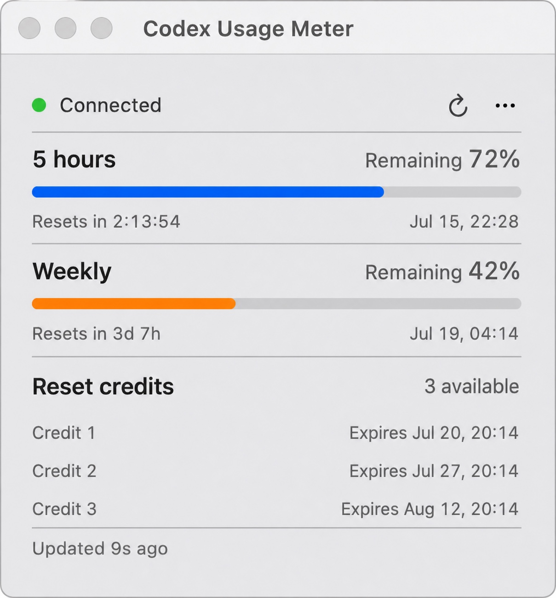

# Codex Usage Meter

**A lightweight, native macOS menu bar app dedicated to Codex limits—there when you need it, quiet otherwise.**

[简体中文](README.md)

**[Download v0.1.4 for macOS](https://github.com/ccssyy888/codex-usage-meter/releases/download/v0.1.4/Codex-Usage-Meter-v0.1.4-macOS.zip)** · [Release notes](https://github.com/ccssyy888/codex-usage-meter/releases/tag/v0.1.4) · [SHA-256](https://github.com/ccssyy888/codex-usage-meter/releases/download/v0.1.4/Codex-Usage-Meter-v0.1.4-macOS.zip.sha256)

<p align="center">
  
</p>
<p align="center"><sub>The remaining five-hour quota stays visible inside one compact menu bar icon.</sub></p>

<p align="center">
  
</p>

When you are deep in a session, the last thing you want is another dashboard. Codex Usage Meter lives quietly in your menu bar and gives you the answer at a glance:

- Glance at your 5-hour quota without leaving the app you are working in
- Keep an eye on weekly usage and exact reset times
- See every reset credit together with its own expiry date
- Stay up to date through automatic refresh and reconnection
- Feel at home in English or Simplified Chinese
- Work with confidence: no analytics, ads, account-file parsing, or log scraping

Codex Usage Meter talks only to your local `codex app-server --stdio` process. It does **not** read or store `~/.codex/auth.json`.

## Design principles: lightweight by scope

“Lightweight” here is not just about having fewer features. It means keeping the product boundary, interaction path, configuration, and data access narrow around one job: checking Codex limits at a glance.

- **There when needed, quiet otherwise.** A floating desktop control is easier to notice, but it still occupies the content area when collapsed and can cover code, webpages, or clicks. Quota is not a live market feed, so the app uses a stable menu bar entry with no desktop overlay or Dock icon.
- **Do one job well.** The project focuses on Codex instead of growing into a multi-provider AI console. That narrower scope means fewer choices, a more direct interface, and a clearer maintenance boundary.
- **Enough information at a glance.** The five-hour window, weekly window, exact reset times, and individual reset-credit expiries fit in one small popover—click, check, and keep working.
- **Keep the data path short and explicit.** Quota data travels from the local Codex app-server to the menu bar and stops there. The app does not read `auth.json`, scan Codex logs, or upload quota data to another service.

## Codex Usage Meter or CodexBar?

Codex Usage Meter is not a replacement for [CodexBar](https://github.com/steipete/CodexBar). The two projects choose different boundaries: CodexBar optimizes for breadth, while Codex Usage Meter optimizes for focus.

| | Codex Usage Meter | CodexBar |
| --- | --- | --- |
| Product scope | A small window dedicated to Codex limits | A unified usage and status tool for many AI coding providers |
| Primary information | Five-hour, weekly, and reset-credit limits | Multi-provider limits, resets, spend, status, and more, depending on the provider |
| Data path | Only the local `codex app-server --stdio` process | Provider-specific CLIs, OAuth, APIs, browser sessions, or local files |
| Best fit | You use mainly Codex and want minimal setup and a short path to the answer | You use several AI services and want centralized management and broader capabilities |

If you need a broad AI usage center, CodexBar is the better fit. If you want Codex quota to sit quietly in your Mac menu bar, this project is built around that choice.

## What you need

- macOS 14 or later
- Apple Silicon or Intel Mac
- Codex CLI installed and signed in (tested with `codex-cli 0.144.4`)

## Get started

1. [Download the macOS ZIP](https://github.com/ccssyy888/codex-usage-meter/releases/download/v0.1.4/Codex-Usage-Meter-v0.1.4-macOS.zip).
2. Unzip it and move **Codex Usage Meter.app** to Applications.
3. Open the app from Applications.

This build is not notarized. If macOS blocks the first launch, try opening the app once, then go to **System Settings → Privacy & Security → Security** and choose **Open Anyway**. Only bypass this warning if you downloaded the app from this repository and trust it. See [Apple's instructions](https://support.apple.com/guide/mac-help/open-a-mac-app-from-an-unknown-developer-mh40616/mac).

Optional integrity check, run from the folder containing both downloads:

```bash
shasum -a 256 -c Codex-Usage-Meter-v0.1.4-macOS.zip.sha256
```

To build from source:

- Xcode 16 or a Swift 6.0+ toolchain

```bash
swift run --disable-sandbox CodexMeterCoreTests
./scripts/build_app.sh
```

The app is created at `outputs/Codex Usage Meter.app`. If Codex is not found automatically, open the meter menu and choose the `codex` executable manually.

Codex Usage Meter uses the local Codex app-server protocol. New Codex CLI releases may require compatibility updates, so please include your CLI version when reporting a problem.

## Private by design

Your usage is yours. Everything stays on your Mac, and the app only remembers the Codex executable you choose. See [PRIVACY.md](PRIVACY.md) for the short, plain-language policy.

## A small project, growing carefully

This project started from a simple wish: make Codex limits easy to understand without getting in the way. It is still early and intentionally focused. If something feels off—or you have a small idea that would make it nicer to use—bug reports and thoughtful improvements are very welcome. See [RELEASING.md](RELEASING.md) for the maintainer release checklist.

## License

[MIT](LICENSE) © 2026 ccssyy888

Codex Usage Meter is an independent, unofficial project. It is not affiliated with or endorsed by OpenAI. “OpenAI” and “Codex” are trademarks of their respective owner.
