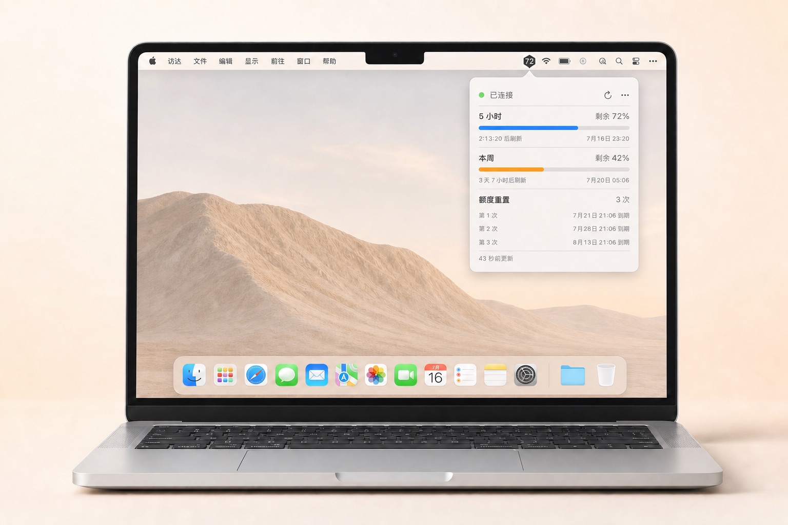
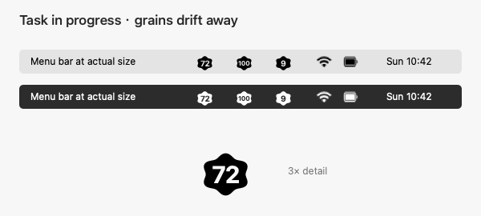
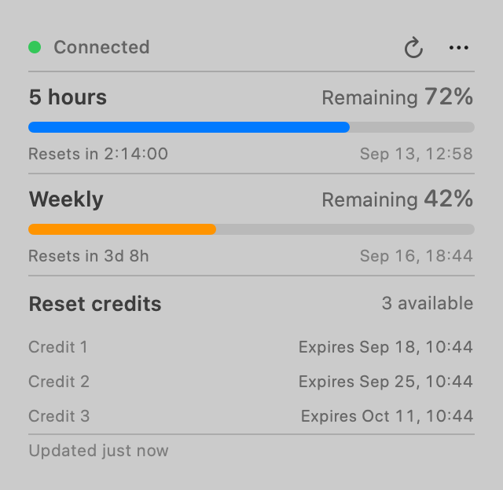

<h1 align="center">Codex Usage Meter</h1>

<p align="center">View Codex quota and local task activity in the macOS menu bar.</p>

<h2 align="center"><a href="https://ccssyy888.github.io/codex-usage-meter/">Visit the website →</a></h2>

<p align="center">
  <a href="https://github.com/ccssyy888/codex-usage-meter/releases/download/v0.2.0/Codex-Usage-Meter-v0.2.0-macOS.zip">Download v0.2.0</a> ·
  <a href="https://github.com/ccssyy888/codex-usage-meter/releases/tag/v0.2.0">Release notes</a> ·
  <a href="https://github.com/ccssyy888/codex-usage-meter/releases/download/v0.2.0/Codex-Usage-Meter-v0.2.0-macOS.zip.sha256">Checksum</a> ·
  <a href="README.md">简体中文</a>
</p>

<p align="center"><sub>macOS 14+ · Apple Silicon / Intel · Free and open source</sub></p>

<p align="center">
  <a href="https://ccssyy888.github.io/codex-usage-meter/">
    
  </a>
</p>
<p align="center"><sub>Product illustration with sample quota values.</sub></p>

## Features

- Shows the remaining five-hour quota in the menu bar. Click to see weekly usage, reset times, and each reset credit's expiry.
- Displays particles above the icon while a local task runs, stopping when it finishes.
- Refreshes automatically and reconnects after interruptions.
- Supports English and Simplified Chinese, with no Dock icon.

Supports Codex only. The animation indicates an ongoing local task, including tool execution and waiting; it does not measure token consumption. Tasks on other devices are not shown.

<details>
<summary>View the animation and quota panel</summary>

<p align="center">
  
</p>
<p align="center">
  
</p>
<p align="center"><sub>v0.2.0 interface demo with sample data.</sub></p>

</details>

## Installation

Requires macOS 14 or later and an installed, signed-in Codex CLI.

1. Download the macOS ZIP linked above.
2. Unzip it and move **Codex Usage Meter.app** to Applications.
3. Open the app. If Codex is not found, select the `codex` executable in the menu bar panel.

The app is not notarized. If macOS blocks it, confirm that the download came from this repository and that you trust it, then choose **Open Anyway** in **System Settings → Privacy & Security → Security**. See [Apple's instructions](https://support.apple.com/guide/mac-help/open-a-mac-app-from-an-unknown-developer-mh40616/mac).

To check integrity, place the ZIP and checksum file in the same folder and run:

```bash
shasum -a 256 -c Codex-Usage-Meter-v0.2.0-macOS.zip.sha256
```

## Data and privacy

Quota comes from a local Codex app-server process with `remote_control` disabled. The app does not read or store `~/.codex/auth.json`.

For task animation, it reads session files held by running Codex processes and parses task start, completion, and interruption events. It does not scan historical session directories. Session content passes through memory during parsing but is not saved to disk or uploaded.

No ads or analytics. The only persisted setting is the Codex executable path you select. See [PRIVACY.md](PRIVACY.md) for file-access and data-handling details.

## Build from source

Requires Xcode 16 or Swift 6.0+:

```bash
swift run --disable-sandbox CodexMeterCoreTests
./scripts/build_app.sh
```

The app is created at `outputs/Codex Usage Meter.app`. To preview task animation:

```bash
open -n "outputs/Codex Usage Meter.app" --args --demo --demo-activity
```

Quota reads were tested with `codex-cli 0.154.0`; task events were tested with the desktop app's bundled `0.154.0-alpha.6.2`. Codex protocol changes may require compatibility updates.

## Feedback

Report bugs and suggestions in [Issues](https://github.com/ccssyy888/codex-usage-meter/issues). Include your macOS and Codex CLI versions when reporting a bug. See [RELEASING.md](RELEASING.md) for the maintainer release process.

## License

[MIT](LICENSE) © 2026 ccssyy888

An independent, unofficial project, not affiliated with or endorsed by OpenAI. “OpenAI” and “Codex” are trademarks of their respective owner.
