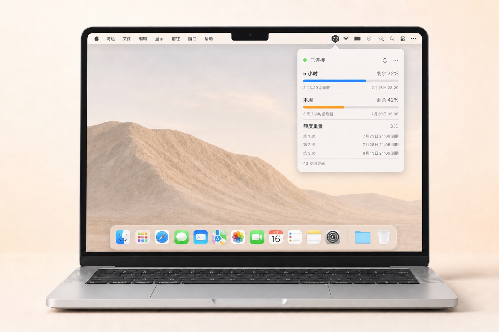

# Codex Usage Meter

**一个轻量、原生、只专注 Codex 的 macOS 菜单栏额度小助手：需要时一眼看清，平时安静待着。**

[English](README.en.md)

**[下载 v0.1.4 macOS 版](https://github.com/ccssyy888/codex-usage-meter/releases/download/v0.1.4/Codex-Usage-Meter-v0.1.4-macOS.zip)** · [版本说明](https://github.com/ccssyy888/codex-usage-meter/releases/tag/v0.1.4) · [SHA-256 校验文件](https://github.com/ccssyy888/codex-usage-meter/releases/download/v0.1.4/Codex-Usage-Meter-v0.1.4-macOS.zip.sha256)

<p align="center">
  
</p>
<p align="center"><sub>收起时，剩余额度始终安静地显示在菜单栏里。</sub></p>

<p align="center">
  
</p>
<p align="center"><sub>展开后，查看 5 小时、本周额度和每次额度重置的到期时间。</sub></p>

写代码正投入时，最不想做的就是停下来翻找另一个页面。Codex Usage Meter 平时安静地待在菜单栏，需要时看一眼，就能知道：

- 不离开正在使用的应用，就能看到 5 小时剩余额度
- 随时了解本周用量和准确刷新时间
- 每次额度重置单独列出，到期时间清清楚楚
- 自动刷新，连接中断后也会自己恢复
- 简体中文和英文都用得顺手
- 放心使用：无广告、无统计，不读取账号文件，也不扫描日志

应用只通过本机的 `codex app-server --stdio` 获取数据，**不会读取或保存** `~/.codex/auth.json`。

## 设计理念：轻量是一种产品边界

这里的“轻量”不只是功能数量少，而是围绕“看一眼 Codex 额度”这件事，尽量缩短操作路径、减少配置和数据接触面。

- **需要时出现，平时安静待着。** 桌面悬浮入口更醒目，但收起后仍会占用内容区，偶尔挡住代码、网页或点击。额度不是需要持续盯着的实时行情，所以入口放在位置稳定的菜单栏，不占桌面，也不显示 Dock 图标。
- **只做好一件事。** 项目只关注 Codex，不把自己扩展成多 AI 服务控制台。更窄的范围换来更少的选项、更直接的界面，以及更清楚的维护边界。
- **一眼够用，不堆仪表盘。** 5 小时额度、本周额度、准确刷新时间和每次额度重置的到期时间集中在一个小窗口里；点一下，看完，继续写。
- **数据路径短而明确。** 额度从本机 Codex app-server 进入菜单栏，到这里就结束；不读取 `auth.json`，不扫描 Codex 日志，也不向额外服务上传额度数据。

## 和 CodexBar 怎么选

Codex Usage Meter 不是 [CodexBar](https://github.com/steipete/CodexBar) 的替代品，两者选择了不同的产品边界：CodexBar 优先覆盖广度，Codex Usage Meter 优先保持专注。

| | Codex Usage Meter | CodexBar |
| --- | --- | --- |
| 产品定位 | 一个只看 Codex 额度的小窗口 | 多个 AI 编程服务的统一用量与状态工具 |
| 关注信息 | 5 小时、本周、额度重置 | 多服务额度、重置、费用、状态等，具体能力随服务而异 |
| 数据路径 | 只连接本机 `codex app-server --stdio` | 按服务使用 CLI、OAuth、API、浏览器会话或本地文件等来源 |
| 更适合 | 只用或主要使用 Codex，希望少配置、点一下就看完 | 同时使用多种 AI 服务，希望集中管理和扩展能力 |

如果你需要一套覆盖面广的 AI 用量中心，CodexBar 更合适；如果你只想让 Codex 额度安静地待在 Mac 菜单栏里，这个项目就是为这种取舍而做的。

## 开始之前

- macOS 14 或更高版本
- Apple Silicon 或 Intel Mac
- 已安装并登录 Codex CLI（已使用 `codex-cli 0.144.4` 验证）

## 安装与使用

1. [下载 macOS ZIP](https://github.com/ccssyy888/codex-usage-meter/releases/download/v0.1.4/Codex-Usage-Meter-v0.1.4-macOS.zip)。
2. 解压后将 **Codex Usage Meter.app** 拖入“应用程序”。
3. 从“应用程序”打开软件。

当前安装包未经过 Apple 公证。如果 macOS 首次打开时阻止运行，请先尝试打开一次，再进入 **系统设置 → 隐私与安全性 → 安全性**，选择 **仍要打开**。只有在确认安装包来自本仓库并且你信任它时才应绕过提示。具体步骤见 [Apple 官方说明](https://support.apple.com/zh-cn/guide/mac-help/mh40616/mac)。

可选：将 ZIP 和校验文件下载到同一目录后验证完整性：

```bash
shasum -a 256 -c Codex-Usage-Meter-v0.1.4-macOS.zip.sha256
```

从源码构建：

- Xcode 16 或 Swift 6.0+ 工具链

```bash
swift run --disable-sandbox CodexMeterCoreTests
./scripts/build_app.sh
```

应用会生成在 `outputs/Codex Usage Meter.app`。如果没有自动找到 Codex，可打开菜单栏面板，手动选择 `codex` 可执行文件。

Codex Usage Meter 使用本机 Codex app-server 协议。新版 Codex CLI 可能需要同步适配，因此反馈问题时请附上 CLI 版本。

## 隐私优先

你的用量只属于你。所有数据都留在 Mac 上，应用只会记住你选择的 Codex 可执行文件路径。简明说明见 [PRIVACY.md](PRIVACY.md)。

## 一个小而认真的项目

这个项目来自一个很简单的愿望：让 Codex 额度更容易看懂，又不打扰正在进行的工作。它还很年轻，也会刻意保持专注。如果哪里用着不顺，或者你想到一个能让体验更舒服的小改进，都欢迎告诉我。维护者发布流程见 [RELEASING.md](RELEASING.md)。

## 开源许可

[MIT](LICENSE) © 2026 ccssyy888

Codex Usage Meter 是独立的非官方项目，与 OpenAI 没有关联，也未获得 OpenAI 背书。“OpenAI”和“Codex”是其各自权利人的商标。
