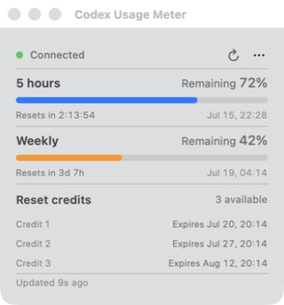

# Codex Usage Meter

**A tiny, native macOS menu bar meter for Codex usage limits and reset credits.**

[简体中文](README.zh-CN.md)



See what matters without opening another dashboard:

- 5-hour quota directly in the menu bar
- Weekly quota and exact reset times
- Every reset credit listed with its own expiry date
- Automatic refresh and reconnection
- English and Simplified Chinese
- No analytics, ads, account file parsing, or log scraping

Codex Usage Meter talks only to your local `codex app-server --stdio` process. It does **not** read or store `~/.codex/auth.json`.

## Requirements

- macOS 14 or later
- Apple Silicon or Intel Mac
- Codex CLI installed and signed in

## Install

Download the latest ZIP from GitHub Releases, unzip it, and move **Codex Usage Meter.app** to Applications. Until notarized builds are available, macOS may show a Gatekeeper warning for downloaded copies.

To build from source:

```bash
swift run --disable-sandbox CodexMeterCoreTests
./scripts/build_app.sh
```

The app is created at `outputs/Codex Usage Meter.app`. If Codex is not found automatically, open the meter menu and choose the `codex` executable manually.

## Privacy

Everything stays on your Mac. See [PRIVACY.md](PRIVACY.md) for the short, plain-language policy.

## Project status

This is an early, focused utility. Bug reports and small improvements are welcome. See [RELEASING.md](RELEASING.md) for the maintainer release checklist.

## License

[MIT](LICENSE) © 2026 ccssyy888

Codex Usage Meter is an independent, unofficial project. It is not affiliated with or endorsed by OpenAI. “OpenAI” and “Codex” are trademarks of their respective owner.
