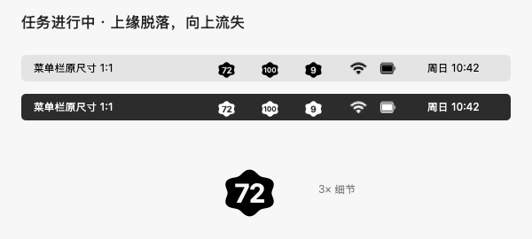
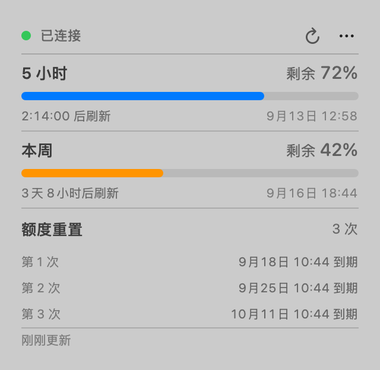

<h1 align="center">Codex Usage Meter</h1>

<p align="center">在 macOS 菜单栏查看 Codex 剩余额度和本地任务状态。</p>

<h2 align="center"><a href="https://ccssyy888.github.io/codex-usage-meter/">访问官网与下载 →</a></h2>

<p align="center">
  <a href="https://github.com/ccssyy888/codex-usage-meter/releases/download/v0.2.0/Codex-Usage-Meter-v0.2.0-macOS.zip">直接下载 v0.2.0</a> ·
  <a href="https://github.com/ccssyy888/codex-usage-meter/releases/tag/v0.2.0">版本说明</a> ·
  <a href="https://github.com/ccssyy888/codex-usage-meter/releases/download/v0.2.0/Codex-Usage-Meter-v0.2.0-macOS.zip.sha256">校验文件</a> ·
  <a href="README.en.md">English</a>
</p>

<p align="center"><sub>macOS 14+ · Apple Silicon / Intel · 免费开源</sub></p>

<p align="center">
  <a href="https://ccssyy888.github.io/codex-usage-meter/">
    
  </a>
</p>
<p align="center"><sub>产品使用示意，画面中的额度为示例。</sub></p>

## 功能

- 菜单栏显示 5 小时剩余额度，点开查看本周用量、刷新时间和每次额度重置的到期时间。
- 本地任务运行时，图标上方显示颗粒动画；任务结束后停止。
- 自动刷新，连接中断后自动重连。
- 支持简体中文和英文，不显示 Dock 图标。

只支持 Codex。任务动画表示本机任务仍在进行，包括工具执行和等待，不代表实时 Token 消耗；其他设备上的任务不会显示。

<details>
<summary>查看任务动画和面板</summary>

<p align="center">
  
</p>
<p align="center">
  
</p>
<p align="center"><sub>v0.2.0 界面演示，数据为示例。</sub></p>

</details>

## 安装

需要 macOS 14 或以上版本，并已安装、登录 Codex CLI。

1. 下载上方的 macOS ZIP。
2. 解压，将 **Codex Usage Meter.app** 拖入“应用程序”。
3. 打开应用。若未找到 Codex，在菜单栏面板中手动选择 `codex` 可执行文件。

安装包尚未经过 Apple 公证。如果系统阻止打开，请先确认文件来自本仓库且你信任它，再到 **系统设置 → 隐私与安全性 → 安全性** 选择 **仍要打开**。详见 [Apple 说明](https://support.apple.com/zh-cn/guide/mac-help/mh40616/mac)。

将 ZIP 和校验文件放在同一目录，可运行：

```bash
shasum -a 256 -c Codex-Usage-Meter-v0.2.0-macOS.zip.sha256
```

## 数据与隐私

额度通过本机 Codex app-server 获取，应用会禁用该进程的 `remote_control`，不会读取或保存 `~/.codex/auth.json`。

任务动画读取运行中 Codex 进程持有的会话文件，解析任务开始、完成和中断事件，不遍历历史会话目录。会话内容在解析时会短暂经过内存，不保存到磁盘，也不上传。

无广告、无统计。应用只持久保存你选择的 Codex 路径。文件读取方式及数据处理细节见 [PRIVACY.md](PRIVACY.md)。

## 从源码运行

需要 Xcode 16 或 Swift 6.0+：

```bash
swift run --disable-sandbox CodexMeterCoreTests
./scripts/build_app.sh
```

构建结果在 `outputs/Codex Usage Meter.app`。预览任务动画：

```bash
open -n "outputs/Codex Usage Meter.app" --args --demo --demo-activity
```

额度查询已在 `codex-cli 0.154.0` 验证，任务事件已在桌面端内置的 `0.154.0-alpha.6.2` 验证。Codex 协议更新后可能需要适配。

## 反馈

问题和建议请提交到 [Issues](https://github.com/ccssyy888/codex-usage-meter/issues)。报告问题时，请附上 macOS 和 Codex CLI 版本。维护者发布流程见 [RELEASING.md](RELEASING.md)。

## 许可

[MIT](LICENSE) © 2026 ccssyy888

独立的非官方项目，与 OpenAI 无关联，也未获其背书。“OpenAI”和“Codex”是其各自权利人的商标。
