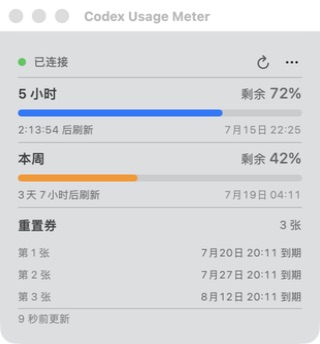

# Codex Usage Meter

**一个轻量、原生、专为 Codex 设计的 macOS 菜单栏额度工具。**

[English](README.md)



不用打开网页，抬眼就能看到真正需要的信息：

- 菜单栏直接显示 5 小时剩余额度
- 查看本周额度和准确刷新时间
- 有几张重置券就显示几张，每张分别显示到期时间
- 自动刷新，连接中断后自动恢复
- 支持简体中文和英文
- 无广告、无统计，不读取账号文件，不扫描日志

应用只通过本机的 `codex app-server --stdio` 获取数据，**不会读取或保存** `~/.codex/auth.json`。

## 使用要求

- macOS 14 或更高版本
- Apple Silicon 或 Intel Mac
- 已安装并登录 Codex CLI（已使用 `codex-cli 0.144.4` 验证）

## 安装

从 GitHub Releases 下载最新 ZIP，解压后将 **Codex Usage Meter.app** 拖入“应用程序”。在正式公证版本提供前，从网络下载的应用可能会触发 macOS Gatekeeper 提示。

从源码构建：

- Xcode 16 或 Swift 6.0+ 工具链

```bash
swift run --disable-sandbox CodexMeterCoreTests
./scripts/build_app.sh
```

应用会生成在 `outputs/Codex Usage Meter.app`。如果没有自动找到 Codex，可打开菜单栏面板，手动选择 `codex` 可执行文件。

Codex Usage Meter 使用本机 Codex app-server 协议。新版 Codex CLI 可能需要同步适配，因此反馈问题时请附上 CLI 版本。

## 隐私

所有数据都留在你的 Mac 上，简明说明见 [PRIVACY.md](PRIVACY.md)。

## 项目状态

这是一个早期、专注的小工具，欢迎反馈 Bug 和轻量改进。维护者发布流程见 [RELEASING.md](RELEASING.md)。

## 开源许可

[MIT](LICENSE) © 2026 ccssyy888

Codex Usage Meter 是独立的非官方项目，与 OpenAI 没有关联，也未获得 OpenAI 背书。“OpenAI”和“Codex”是其各自权利人的商标。
